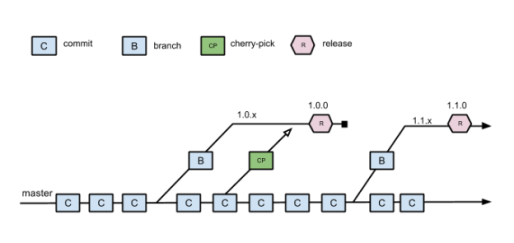
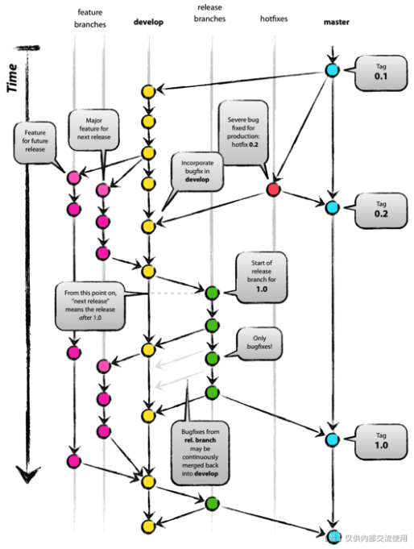
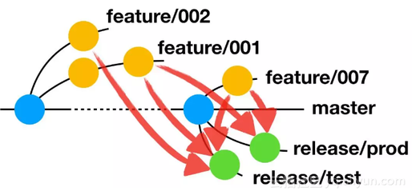

# Git Flow

## 常见策略

### **Trunk-Based**

> 标题：[谷歌的代码管理](http://www.ruanyifeng.com/blog/2016/07/google-monolithic-source-repository.html)
>
> 作者：阮一峰

单主干的分支实践（Trunk-based development，TBD）在 SVN 中比较流行。[Google](http://paulhammant.com/2013/05/06/googles-scaled-trunk-based-development/) 和 [Facebook](http://paulhammant.com/2013/03/13/facebook-tbd-take-2/) 都使用这种方式。trunk 是 SVN 中主干分支的名称，对应到 Git 中则是 master 分支。TBD 的特点是所有团队成员都在单个主干分支上进行开发。当需要发布时，先考虑使用标签（tag），即 tag 某个 commit 来作为发布的版本。如果仅靠 tag 不能满足要求，则从主干分支创建发布分支。bug 修复在主干分支中进行，再 cherry-pick 到发布分支。图 1 是 TBD 中分支流程的示意图。

由于所有开发人员都在同一个分支上工作，团队需要合理的分工和充分的沟通来保证不同开发人员的代码尽可能少的发生冲突。持续集成和自动化测试是必要的，用来及时发现主干分支中的 bug。因为主干分支是所有开发人员公用的，一个开发人员引入的 bug 可能对其他很多人造成影响。不过好处是由于分支所带来的额外开销非常小。开发人员不需要频繁在不同的分支之间切换。

### **Feature-Based，Git-Flow 及其衍生** 

### **Aone-Flow**

AoneFlow 基本上兼顾了 TrunkBased 的“易于持续集成”和 GitFlow 的“易于管理需求”特点，同时规避掉 GitFlow 的那些繁文缛节。

#### 基本规则

三种类型分支：

* 主干分支 `master` 
* 特性分支 `feature/*`
* 发布分支 `release/*`

三条基本规则：

* **规则一，开始工作前，从主干创建特性分支。**

  每当开始一件新的工作项（feature\|hotfix）的时候，就从主干分支（master）上创建一个以 `feature/*` 前缀命名的特性分支，然后在这个分支上提交代码修改。也就是说，每个工作项（独自或协同完成）对应一个特性分支，所有的修改都不允许直接提交到主干。

* **规则二，通过合并特性分支，形成发布分支。**

  从主干上拉出一条新分支，将所有本次要集成或发布的特性分支依次合并过去，从而得到发布分支（qa\|prod） 。发布分支通常以 `release/*` 命名。

* **规则三，发布到线上正式环境后，合并相应的发布分支到主干，在主干添加标签，同时删除该发布分支关联的特性分支。**

  当一条发布分支上的流水线完成了一次线上正式环境的部署，就意味着相应的功能真正的发布了，此时应该将这条发布分支合并到主干，并清理掉已经上线部分的特性分支。主干分支上的最新版本始终与线上版本一致，如果要回溯历史版本，只需在主干分支上找到相应的版本标签即可。

## 通用规则

#### **一次提交应该对应一个相关的改动**

例如，两个不同的错误应该对应两次不同的提交。使它更容易让其他开发人员明白这个改动。如果这次改动存在问题，也可以方便的回滚到改动之前的状态。通过暂存区标记功能，Git 可以轻松打造非常精确的提交。

#### **经常性的提交修改**

经常的提交改动可以更方便为它作注释，从而更容易确保提交的注释和改动的一致性。通过频淤快速的提交来与其他的开发人员共享这些改动。那样就会避免或减少代码整合时带来的冲突，反之，非常庞大的提交将会增大整合时出现冲突的风险。

#### **不要提交不完整的改动**

对于一个很大的功能模块来说，完成后再提交并不愈味。必须整体完成后才可以，而是要把它正确分创成小的完整的逻辑模块进行经常性的提文。一定不要提交一些不完整的改动。诸如仅仅是因为下班之类的原因。同样，如果只是为了得到一个干净的工作区城也不要立即提交．可以通过 git stash 命令把这些改动移到另外的分支。

#### **提交前进行代码测试**

不要提交还没有进行完整测试的改动。只有经过测试，并确定无误的改动才能提交。把改动发送给开发团队其他成员前，必须确定所有修改已经完整侧试过（包括代码规则检查）。这样才算是真正的完成。

#### **高质量的提交注释**

提交注释的开头需要一个少于 50 个字的简短说明．在一个空白的分创行之后要写出一个详细的提交细节．比如回答如下的两个问题：

* 出于什么理由姗要这个修改？
* 签于当前版本．其体改动了什么？

      为了和自动生成的注释保持一致（例如： git merge \)，一定要使用现在时态祈使句（比如使用 change 而不要使用 changed 和 changes \) 。

#### **提交那些有意义的改动，版本控制不是备份**

版本控制系统具有一个很强大的附带功能。那就是服务器端的备份功能。但是不要把 VcS 当成一个备份系统。一定要注意。只需要提交那些有意义的改动。而不要仅仅作为文件存储系统来使用。（提交要对应修改 \)

#### **使用分支功能**

自始至终，Git的核心就是提供一个快速,简单和灵活的分支功能。分支是一个非常优秀的工具，用来帮助开发人员解决在日常团队开发中存在的代码冲突的问题。因此分支功能应该广泛的运用在不同的开发流程中比如：开发新的功能，修错等等。

#### **在特性分支中执行开发工作。**

这样，所有的工作都是在专用的分支而不是在主分支上隔离完成的。它允许您提交多个 pull request 而不会导致混乱。您可以持续迭代提交，而不会使得那些很可能还不稳定而且还未完成的代码污染 master 分支。更多请阅读：Merging vs. Rebasing \[[English](https://segmentfault.com/a/1190000007942341)\] - \[[中文](https://segmentfault.com/a/1190000007942341)\]

#### **不要将分支（直接）推送到汇合分支主 —— 分支或发布分支，请使用合并请求（Pull Request）。**

通过这种方式，它可以通知整个团队他们已经完成了某个功能的开发。这样开发伙伴就可以更容易对代码进行 code review，同时还可以互相讨论所提交的需求功能。

#### **在进行合并请求之前，请确保您的功能分支可以成功构建，并已经通过了所有的测试（包括代码规则检查）。**

 因为您即将将代码提交到这个稳定的分支。而如果您的功能分支测试未通过，那您的目标分支的构建有很大的概率也会失败。此外，确保在进行合并请求之前应用代码规则检查。因为它有助于我们代码的可读性，并减少格式化的代码与实际业务代码更改混合在一起导致的混乱问题。

#### **在进行合并请求之前，准备推送所开发的功能时，请更新您本地的合并目标分支并且完成交互式变基操作。**

 rebase 操作会将（本地开发分支）合并到被请求合并的分支（ `master` 或 `develop` ）中，并将您本地进行的提交应用于所有历史提交的最顶端，而不会去创建额外的合并提交（假设没有冲突的话），从而可以保持一个漂亮而干净的历史提交记录。

#### **在进行合并请求之前，发起合并请求之前，请先解决完潜在的冲突。**

**在合并分支之后，要删除本地和远程功能分支。**

* 如果不删除需求分支，大量僵尸分支的存在会导致分支列表的混乱。而且该操作还能确保有且仅有一次合并到目标分支（主干分支或发布分支等）。只有当这个功能还在开发中时对应的功能分支才存在。

#### **保护您的 主干分支 分支。**

因为这样可以保护您的生产分支免受意外情况和不可回退的变更。 更多请阅读 -&gt; [Github](https://help.github.com/articles/about-protected-branches/)

#### **合理的工作流程**

Git可以支持很多不同流程:长期分支,特性分支,合并或是重置,git-flow等等.选择哪一种流程要取决于如下一些因素:什么项目,什么样的开发,部署模式和\(可能是最重要的\)开发团队人员的个人习惯.不管怎样选择什么样的流程都要得到所用开发人员的认同并且一直遵循它。

#### **使用**  [.gitignore](https://github.com/github/gitignore) **文件。**

此文件已经囊括了不应该和您开发的代码一起推送至远程仓库（remote repository）的系统文件列表。另外，此文件还排除了大多数编辑器的设置文件夹和文件，以及最常见的（工程开发）依赖目录。

