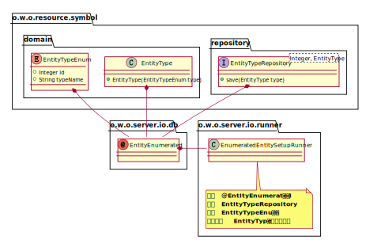

# Symbols - 符号

## 基本结构

由 `Entity`、`EntityType` 和 `EntitySpace`  组成。其中，`Entity` 和 `EntityType` 属于包含了公共属性对象，具体的能力由继承了 `EntitySpace` 的类来实现。注： `A` 代表实体成员。

此外，`EntityType` 为枚举类型。其持久化过程如下：

## 实体成员

### Dot

Ink 的最基本组成单位，也是引用的基本组成单元。

#### 类型

Dot 的主要类型有：

* 文本类型 TEXT
* 资源类型 RESOURCE
  * 图片 PICTURE
  * 音频 AUDIO
  * 视频 VIDEO
  * 文件 BINARY（二进制） & TEXT（文本）
* 引用类型 REFERENCE
  * 站内资源
    * Dot，Dot 本身可通过 Symbols 被引用：symbols.dot\[s\].reference-content
  * 站外资源
    * 图片
    * 第三方嵌入，如 Bilibili、优酷视频、网易云音乐等。
* 混合类型 COMBINATION
  * 混合结构

### Org

Ink 的类属描述。同 Dot 一样的 `type ⇥ space` 结构。

#### 类型

Org 的主要类型有：

* SET，集合类型，实现：
  * 标签功能。
* TREE，树状类型
  * 书籍 —— 组织 Symbols 到目录树，实现书籍功能。
  * 网站地图功能。
  * 分组标签功能。
* CLASSIFICATION
  * 分类树，例如生物分类：界/门/纲/目/科/属/种。
  * 分类集，例如五脏六腑：心肝脾胃肾；食物营养成分等。

### Ink

由 Dot 和 Org 组成。具备表达的基本单位。

### Way

由 Ink 组成。

